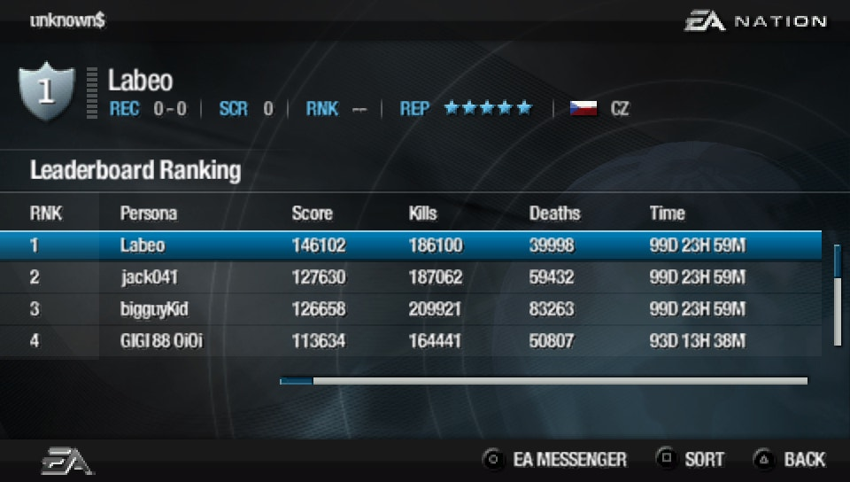

# Master Server for Medal Of Honor Heroes 1 & 2

This project aims to provide a master server for Medal of Honor Heroes 1 (PSP) and 2 (PSP/Wii).  
It uses the `User Hosted Server` formerly distributed by EA to host games for MoHH1.  
For MoHH2, a serverless patch has been made to allow playing alone on multiplayer maps. Playing with others isn't
possible yet.

## Discord

[](https://discord.gg/fwrQHHxrQQ)

It is used to :

- Talk about the game
- Share technical knowledge
- Centralize documentation
- Regroup the community and organize events

Fell free to join !

## Wiki

Everything to know is in the [Wiki](https://github.com/a-blondel/mohh-master-server/wiki)  
It contains :

- Generic info about the games (weapons, maps,...)
- Technical knowledge (packet capture, ...)

## Development Status

You can follow the progress on the [project board](https://github.com/users/a-blondel/projects/2/views/1)

### Features

- [x] Access Nintendo WFC (Either with [nwc-server](https://github.com/a-blondel/nwc-server) or Wiimmfi) for the Wii
  version of MoHH2
- [x] EA account management
    - [x] Create account
    - [x] Update account
    - [x] Use account
    - [x] Create persona
    - [x] Delete persona
    - [x] Use persona
    - [X] Account recovery
    - [X] Password reset
- [x] Main menu
    - [x] Player info (Country, Kills, Deaths, Score, Rank, Reputation)
    - [x] Online player count
- [x] Lobby
    - [x] Games available
    - [x] Players in game
    - [x] Filter options
    - [x] Create game
    - [x] Join game
- [x] Leaderboards
    - [x] My EA Leaderboard
    - [x] EA Top 100
    - [x] EA Weapon Leaders
- [x] My profile
    - [x] FAQ
    - [x] Terms and conditions
- [x] EA Messenger
    - [x] List friends/friend requests/blocked/recent opponents
    - [x] Display players statuses - Online/In-Game (with game title) or Offline
    - [x] Find Player
    - [x] Send message
    - [x] Send friend request
    - [x] Block
    - [x] Feedback

Note that error messages eg 'invalid password'/'unknown account' are more or less complete.

MoHH screenshots :

 <br/>
*Player details / Leaderboards*

 <br/>
*Lobbies / In Game*


MoHH2 screenshots :

 <br/>
*Player details / Leaderboards*

 <br/>
*Lobbies / In Game (serverless patch)*

### Play online

- MoHH multiplayer is functional - Games can be hosted using the UHS (User Hosted Server)
- MoHH2 multiplayer isn't functional yet - Work is in progress. However, it's possible to play alone on MP maps thanks
  to a patch (see below).

## Development requirements

### 1/ Riivolution patches (Wii only)

Nintendo Wi-Fi Connection (NWC) servers have been shut down, and the Wii version of MoHH2 relied on these.

To make the game to use this server you need to enable a `Private Server` Riivolution patch when booting the game.  
You can use either `NoSSL` or `Wiimmfi` options. This server contains a built-in NWC server to be used with `NoSSL`
option if you redirect `naswii.nintendowifi.net` traffic (next chapter).  
Riivolution patches can be found here : https://github.com/a-blondel/mohh2-wii-patch

### 2/ Hosts file or DNS

In order to intercept packets from the game, you must either use a DNS server or edit your hosts file.

- Hosts file (for PPSSPP/Dolphin)

Add these lines to your hosts file (`C:\Windows\System32\drivers\etc`) :

```
127.0.0.1 pspmoh07.ea.com
127.0.0.1 wiimoh08.ea.com
127.0.0.1 pspmoh08.ea.com
127.0.0.1 naswii.nintendowifi.net
```

- DNS (for the Wii / PSP)

    - Host a DNS server (i.e. dnsmasq or [Unbound](https://nlnetlabs.nl/projects/unbound/about/)) to redirect packets to
      the
      machine hosting the server.
    - Configure the console to use the DNS server

Unbound configuration (`service.conf`) :

```
server:
	# verbosity level 0-4 of logging
	verbosity: 1

	# On windows you may want to make all the paths relative to the
	# directory that has the executable in it (unbound.exe).  Use this.
	directory: "%EXECUTABLE%"

	# if you want to log to a file use
	logfile: "unbound.log"
	
	interface: ::1
	interface: 127.0.0.1
	interface: 192.168.1.1 # CHANGE IT !
	
	port: 53
	
	access-control: 127.0.0.0/24 allow
	access-control: 192.168.0.0/16 allow
	access-control: ::1 allow
	
	root-hints: "named.cache"
	
	local-zone: "pspmoh07.ea.com" static
	local-data: "pspmoh07.ea.com A 192.168.1.1" # CHANGE IT !
	
	local-zone: "wiimoh08.ea.com" static
	local-data: "wiimoh08.ea.com A 192.168.1.1" # CHANGE IT !
	
	local-zone: "pspmoh08.ea.com" static
	local-data: "pspmoh08.ea.com A 192.168.1.1" # CHANGE IT !
	
	local-zone: "naswii.nintendowifi.net" static
	local-data: "naswii.nintendowifi.net A 192.168.1.1" # CHANGE IT !
```

Change `192.168.1.1` to your server's IP address.

### 3/ JDK

This project runs with the `JDK 21`, download it if needed.

### 4/ Maven

If you have downloaded Intellij, Maven comes bundled with, otherwise download the latest version of Maven.

## Run the server

### Development profile

By default, the server uses a Postgres database, but you can use the embedded H2 database for development so you don't
need to install/run a database.

To do so, enable the `dev` profile when starting the server (VM Option `-Dspring.profiles.active=dev`).

The h2 console can be accessed in a browser when the server is running :

```
http://localhost:8080/h2/
```

The username and password are `sa` (see `application.yml`).

The `dev` profile also provides a set of sample data to quickly test the server. Default credentials are :

```
labeo:pass
jack:pass
gigi:pass
```

### 1. Build the project

Run the following command :  
`mvn clean package`

This will download dependencies, build the project and create a jar file in the `target` folder.

### 2. Run the server

Before running the server, you need to know some environment variables:

| Variable             | Required | Default          | Description                                                  |
|----------------------|----------|------------------|--------------------------------------------------------------|
| TCP_HOST_IP          | Yes      | 127.0.0.1        | IP address to bind TCP servers                               |
| TCP_DEBUG_ENABLED    | No       | false            | Verbose TCP debug logging. Advised to enable for development |
| TCP_DEBUG_EXCLUSIONS | No       | ~png,+snp        | Exclusion filter for TCP debug                               |
| DB_URL               | Yes      | -                | JDBC URL for the database. Optional on dev profile           |
| DB_USERNAME          | Yes      | -                | Database username. Optional on dev profile                   |
| DB_PASSWORD          | Yes      | -                | Database password. Optional on dev profile                   |
| DB_PORT              | No       | 5432             | Database port. Optional on dev profile                       |
| LOGS                 | No       | -                | Log directory                                                |
| SERVER_PORT          | No       | 8080             | Local HTTP port (Spring API)                                 |
| HTTP_PORT            | No       | 80               | Exposed HTTP port (reverse proxy/tunnel)                     |
| DNS_NAME             | No       | http://localhost | DNS name used for API and links                              |
| SSL_DEBUG_ENABLED    | No       | false            | Enable SSL debug logging                                     |
| MAIL_HOST            | No       | smtp.gmail.com   | SMTP host for sending emails                                 |
| MAIL_PORT            | No       | 587              | SMTP port                                                    |
| MAIL_USERNAME        | No       | test@example.com | SMTP username                                                |
| MAIL_PASSWORD        | No       | -                | SMTP password                                                |

**Notes:**

- Required variables depend on your configuration (e.g., DB_URL, DB_USERNAME, and DB_PASSWORD are required unless using
  the dev profile).
- Variables not set will use the default value above.
- To work on email features, either use fakeSMTP or create a Gmail account, and set the `MAIL_*` variables.

### 2.a Start the server in Intellij

Create a new Application config in Intellij and set the following entry-point (main class) :

```
com.ea.ServerApp
```

Define the environment variables matching your needs, mostly for the database if you don't use the `dev` profile, e.g. :

```
TCP_HOST_IP=127.0.0.1;TCP_DEBUG_ENABLED=true;DB_URL=jdbc:postgresql://localhost:5432/mohh_db;DB_USERNAME=user;DB_PASSWORD=password
```

### 2.b Start as a standalone jar

After a successful build, get into the target folder and execute one the following commands:

```
java -DTCP_HOST_IP=127.0.0.1 -DDB_URL=jdbc:postgresql://localhost:5432/mohh_db -DDB_USERNAME=user -DDB_PASSWORD=password -jar mohh-master-server-*.jar
```

### 2.c Start with Docker

Create the image

```
docker build --tag mohh-master-server:latest .
```

You need to start a postgres container after creating a network.  
It is advised to use a volume to persist the data of the postgres container (adapt `~/postgres_data` to your
configuration), and to automatically restart the container on OS boot.

```
docker network create mohh-network

docker pull postgres:latest

mkdir ~/postgres_data

docker run -d --restart=unless-stopped --network mohh-network \
-e POSTGRES_USER=user \
-e POSTGRES_PASSWORD=password \
-e POSTGRES_DB=mohh_db \
-p 5432:5432 \
-v ~/postgres_data:/var/lib/postgresql/data \
--name postgres \
postgres:latest
```

Then, you can start the server using the network :

```
docker run -d --name mohh-master-server --rm -it \
  -p 8080:8080 \
  -p 11180:11180 -p 11181:11181 -p 11190:11190 -p 11191:11191 \
  -p 21180:21180 -p 21181:21181 -p 21190:21190 -p 21191:21191 \
  -p 21170:21170 -p 21171:21171 -p 21120:21120 -p 21121:21121 \
  -e "LOGS=./logs" -e "TCP_HOST_IP=127.0.0.1" \
  -e "DB_URL=jdbc:postgresql://postgres:5432/mohh_db" \
  -e "DB_USERNAME=user" -e "DB_PASSWORD=password" \
  --network mohh-network \
  mohh-master-server:latest
```

Here is how to open a bash in the container so you can check the logs or run commands :

```
docker container ls
docker exec -it mohh-master-server bash
```

## Database

To manage the database schema, **liquibase** is used. The main configuration file is
`db/changelog/db.changelog-master.yaml`.

It is recommended to use a **postgres** database.  
You can install it on your machine or use a docker container (see `2.c Start with Docker` chapter for the docker setup,
but you can ignore the network part if you run the server without docker).

### Database Schemas and Tables

The project database is organized into several schemas, each grouping related tables:

- **core**: Contains all generic account and game management tables.
    - `ACCOUNT`: User accounts
    - `BLACKLIST`: Banned IPs
    - `PERSONA`: Player personas (profiles)
    - `PERSONA_CONNECTION`: Player connection history
    - `GAME`: Game sessions (generic, not specific to a title)
    - `GAME_CONNECTION`: Player connections to game sessions

- **stats**: Contains tables for game-specific statistics.
    - `MOHH_GAME_REPORT`: Detailed match/game reports for Medal of Honor Heroes 1 & 2
    - `MOHH_PERSONA_STATS`: Cumulative player statistics for Medal of Honor Heroes 1 & 2

- **social**: Contains tables for social features and interactions.
    - `BUDDY`: Friend relationships
    - `FEEDBACK`: Player feedback
    - `FEEDBACK_TYPE`: Types of feedback
    - `MESSAGE`: Private messages between players

<br/>
*Database diagram (each schema is represented by a different color)*

Data samples are provided in the `db/samples` folder for a quick start :

- `basic.sql` (lightweight, suitable for most cases)
- `full.sql` (mainly for leaderboards testing)

The `dev` profile uses `db/changelog/db.changelog-master-populate.yaml` main file, which runs the `basic.sql` sample.

## Adding TCP Servers Dynamically

You can add new TCP servers on the fly by editing the `game.servers` section in `application.yml` file.  
Each server is described as an object with several properties. Below is a table describing the available properties,
whether they are optional, and their default values:

| Property       | Optional | Default | Description                                                                             |
|----------------|----------|---------|-----------------------------------------------------------------------------------------|
| vers           | No       | -       | Game version identifier (VERS string)                                                   |
| enabled        | Yes      | true    | Whether the server is enabled                                                           |
| sdk            | Yes      | ""      | Game SDKVERS number (for logic by SDK version)                                          |
| aries          | Yes      | true    | If true, server is Aries (EA Nation) type; false for Buddy (EA Messenger)               |
| p2p            | Yes      | true    | If true, server is P2P; false for dedicated                                             |
| dedicated.vers | Yes      | -       | VERS string of dedicated server (if applicable)                                         |
| dedicated.slus | Yes      | -       | SLUS code of dedicated server (if applicable)                                           |
| dedicated.port | Yes      | -       | TCP port of dedicated server (if applicable)                                            |
| ssl.enabled    | Yes      | true    | If enabled, creates SSL servers for each region's port + 1 on following domain name     |
| ssl.domain     | Yes      | -       | Domain name for SSL certificate (if applicable). Mandatory if SSL is enabled            |
| regions        | No       | -       | List of regions served by this server                                                   |
| regions[].name | No       | -       | Name of the region (can be anything as long as there is one region per port to support) |
| regions[].port | No       | -       | TCP port for the region                                                                 |
| regions[].slus | No       | -       | List of SLUS codes for the region                                                       |

**Notes:**

- Properties not set in `application.yml` will use the default values above.

## Credits

In addition to the direct [contributors](https://github.com/a-blondel/mohh-master-server/graphs/contributors), the
following projects were inspiring in the development of this project:

- EA SSL certificate vulnerability
    - https://github.com/Aim4kill/Bug_OldProtoSSL (analysis)
    - https://github.com/valters-tomsons/arcadia (implementation)
- Nintendo WFC server emulator
    - https://github.com/barronwaffles/dwc_network_server_emulator
- Related EA server emulators with more or less similar TCP packets
    - https://github.com/HarpyWar/nfsuserver
    - https://github.com/VTSTech/VTSTech-SRVEmu
    - https://github.com/nleiten/ea-server-emu-startpoint
- Buddy (EA Messenger) server emulator
    - https://gitlab.com/gh0stl1ne/eaps
